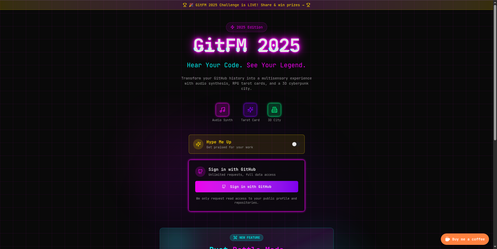

# 🎸 GitFM: Your 2025 GitHub Unwrapped



**GitFM** is the ultimate interactive experience for developers to visualize, hear, and share their year in code. Far beyond simple charts, GitFM turns your GitHub contribution graph into a cyberpunk city, a symphony of sound, and a cinematic space journey.

## ✨ Key Features

### 🏙️ Code City 3D
Visualize your repositories as a sprawling cyberpunk metropolis.
- **Skyscrapers**: Represent your most active repositories.
- **Neon Lights**: Glow based on the languages used.
- **Interactive**: Fly through your code history in a 3D environment powered by **Three.js**.

### 🎵 Audio Symphony
Listen to the sound of your code.
- **Generative Music**: Your commit history is translated into a unique lo-fi/synth-wave track using **Tone.js**.
- **Rhythm**: Commit frequency dictates the tempo and intensity.
- **Melody**: Languages and activity types shape the melody.

### 🔮 Developer Tarot Cards
Discover your developer archetype.
- **RPG-Style Stats**: Are you a *Bug Hunter*, *Code Wizard*, or *Repo Titan*?
- **Roast vs. Praise**: Toggle between a hype-up card or a humble-roast card.
- **Shareable**: Beautifully designed cards ready for Instagram and Twitter.

### 🎬 Space Mission Video
Create a viral-ready cinematic video of your year.
- **Story Mode**: An astronaut's journey through your code universe.
- **Warp Speed**: Travel through your commits, stars, and contributions.
- **Social Ready**: Generates a vertical (9:16) video perfect for TikTok, Reels, and Shorts.
- **Client-Side Generation**: Privacy-first video rendering using the Canvas API and MediaRecorder.

## 🛠️ Tech Stack

Built with the cutting-edge web technologies of 2025:

- **Framework**: [Next.js 16](https://nextjs.org/) (App Router)
- **UI Library**: [React 19](https://react.dev/)
- **Styling**: [Tailwind CSS 4](https://tailwindcss.com/)
- **3D Graphics**: [React Three Fiber](https://docs.pmnd.rs/react-three-fiber) & [Drei](https://github.com/pmndrs/drei)
- **Audio**: [Tone.js](https://tonejs.github.io/)
- **Icons**: [Lucide React](https://lucide.dev/)
- **Components**: [Radix UI](https://www.radix-ui.com/) (via shadcn/ui)

## 🚀 Getting Started

Follow these steps to launch GitFM locally:

1.  **Clone the repository**
    ```bash
    git clone https://github.com/yourusername/gitfm.git
    cd gitfm
    ```

2.  **Install dependencies**
    ```bash
    npm install
    # or
    yarn install
    # or
    pnpm install
    ```

3.  **Run the development server**
    ```bash
    npm run dev
    ```

4.  **Open your browser**
    Navigate to `http://localhost:3000` to start your journey.

## 🤝 Contributing

We welcome contributions from the community! Whether it's a new "Code City" building type, a fresh synth preset for the Audio Symphony, or a new scene for the Video Generator.

1.  Fork the project.
2.  Create your feature branch (`git checkout -b feature/AmazingFeature`).
3.  Commit your changes (`git commit -m 'Add some AmazingFeature'`).
4.  Push to the branch (`git push origin feature/AmazingFeature`).
5.  Open a Pull Request.

## 📄 License

Distributed under the MIT License. See `LICENSE` for more information.

---

<p align="center">
  Built with ❤️ by the Aditya Sharma (dub.sh/adityax)
</p>
